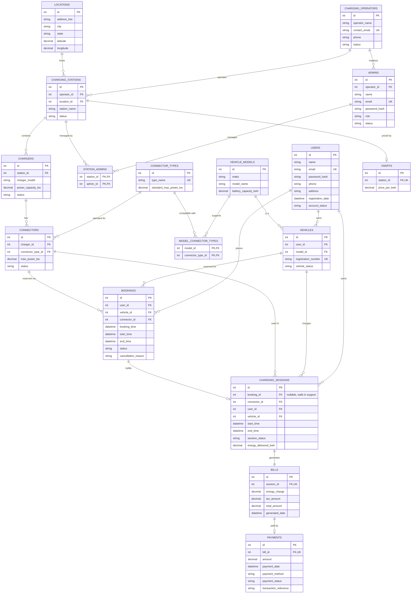

# EV Charging Network Management System — MVP Entity-Relationship Diagram

This is the finalized MVP schema (17 tables), derived from the original 26-entity
rough draft after a requirements discussion. See `SCHEMA.md` for the reasoning
behind every change.

