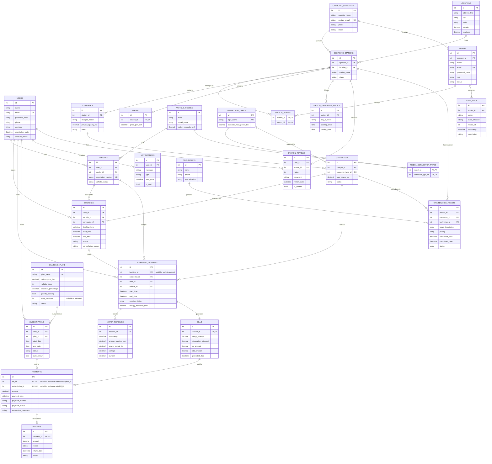

# EV Charging Network Management System — Entity-Relationship Diagram

This is the complete schema (27 tables), derived from the original 26-entity
rough draft after a requirements discussion. See `SCHEMA.md` for the
reasoning behind every change, and which entities were added in which pass
(MVP first, then everything else).

